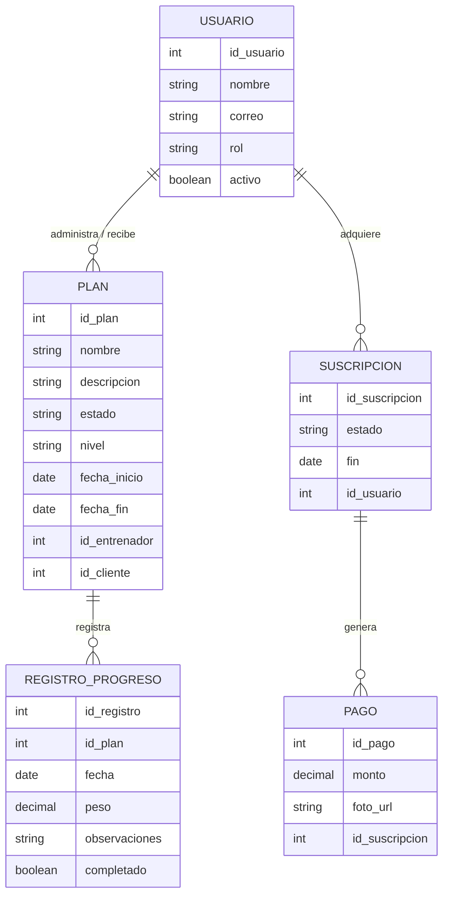
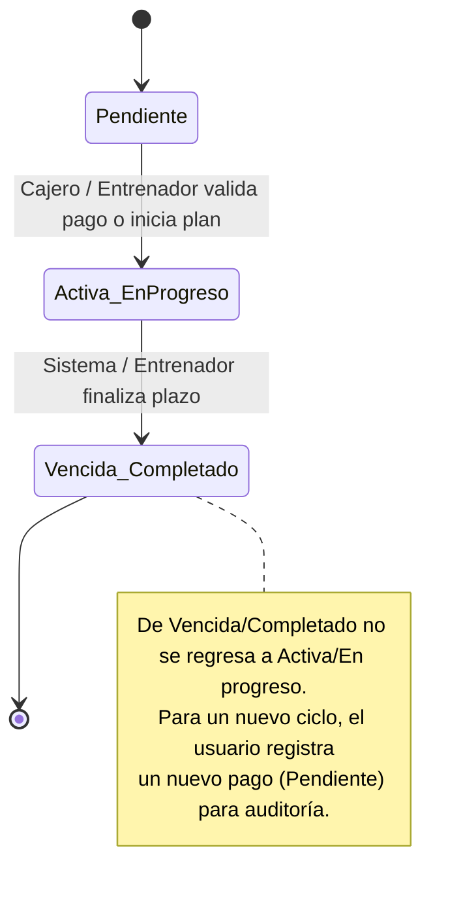

# Hito 1 · Ficha del negocio

**Pareja:** Avila Derian · Mieles Jostin  
**Paralelo:** Aplicaciones para el Cliente Web B  
**Negocio en una línea:** PowerFit (GYM & WELLNESS PRO) es un sistema SaaS de gestión y membresías/planes para gimnasios locales y entrenadores personales.

## 1. Negocio de referencia

PushPress es una plataforma que vende software de gestión integral a dueños de gimnasios y centros de acondicionamiento físico. Su modelo de negocio se basa en el cobro de una suscripción mensual en modalidad SaaS. Según declaraciones del fundador, la empresa alcanzó una cifra de $15M ARR (Ingresos Anuales Recurrentes) en el año 2024.

**Enlace:** https://getlatka.com/companies/pushpress

## 2. Caso de contraste

GymPact (Pact App) fue una aplicación dirigida a consumidores finales (B2C) que terminó siendo clausurada. La hipótesis de su fracaso se debe a su modelo punitivo: cobraba multas a los usuarios que no cumplían con sus rutinas de ejercicio. Al depender financieramente del fracaso y penalización de sus propios clientes, destruyó la confianza del usuario final y quebrantó la sostenibilidad de la plataforma.

**Fuente:** https://gizmodo.com/app-that-paid-users-to-exercise-owes-nearly-1-million-1818632078

## 3. Adaptación al Ecuador

1. **Prevalencia del pago manual:** Alrededor del 70% de los usuarios realiza sus pagos mediante transferencia bancaria directa o depósito en efectivo. Esto obliga al negocio a implementar una conciliación manual de comprobantes.
2. **Limitación de cobros automáticos:** Gran parte de los clientes locales no dispone de tarjeta de crédito habilitada para débito automático recurrente. Esto impide la renovación automática mensual típica de un SaaS tradicional.
3. **Normativa tributaria local:** Es indispensable alinearse al régimen tributario local (RIMPE), exigiendo la emisión de facturación simplificada según el perfil fiscal del negocio.

**Qué cambió en el modelo por estas restricciones:** Se agregó el estado **"Pendiente"** al flujo de suscripciones/planes y se creó el rol de **"Cajero"** (o Administrador) encargado de verificar y auditar las transferencias manuales enviadas por el cliente antes de activar el servicio.

## 4. Modelo de datos

### Entidad: Usuario

| Atributo | Tipo | Obligatorio | Ejemplo |
|----------|------|-------------|---------|
| id_usuario | número entero | Sí | 1 |
| nombre | texto | Sí | Carlos Mendoza |
| correo | texto | Sí | carlos.mendoza@gympro.ec |
| rol | uno de: (Entrenador, Cliente, Cajero) | Sí | Entrenador |
| activo | sí/no | Sí | Sí |

### Entidad: Plan

| Atributo | Tipo | Obligatorio | Ejemplo |
|----------|------|-------------|---------|
| id_plan | número entero | Sí | 301 |
| nombre | texto | Sí | Rutina de hipertrofia y dieta alta en proteína |
| descripcion | texto | No | Enfocado en ganar masa muscular |
| estado | uno de: (Pendiente, En progreso, Completado) | Sí | Pendiente |
| nivel | uno de: (Principiante, Intermedio, Avanzado) | Sí | Intermedio |
| fecha_inicio | fecha | Sí | 2026-10-01 |
| fecha_fin | fecha | No | 2026-11-01 |
| id_entrenador | referencia a otra entidad | Sí | 1 |
| id_cliente | referencia a otra entidad | Sí | 101 |

### Entidad: Suscripcion

| Atributo | Tipo | Obligatorio | Ejemplo |
|----------|------|-------------|---------|
| id_suscripcion | número entero | Sí | 5001 |
| estado | uno de: (Pendiente, Activa, Vencida) | Sí | Pendiente |
| fin | fecha | Sí | 2026-10-31 |
| id_usuario | referencia a otra entidad | Sí | 101 |

### Entidad: Pago

| Atributo | Tipo | Obligatorio | Ejemplo |
|----------|------|-------------|---------|
| id_pago | número entero | Sí | 801 |
| monto | número decimal | Sí | 35.00 |
| foto_url | texto | Sí | https://storage.com/comprobante301.png |
| id_suscripcion | referencia a otra entidad | Sí | 5001 |

### Entidad: RegistroProgreso

| Atributo | Tipo | Obligatorio | Ejemplo |
|----------|------|-------------|---------|
| id_registro | número entero | Sí | 901 |
| id_plan | referencia a otra entidad | Sí | 301 |
| fecha | fecha | Sí | 2026-10-01 |
| peso | número decimal | No | 74.5 |
| observaciones | texto | No | Cumplió todas las series sin inconvenientes |
| completado | sí/no | Sí | Sí |

### Relaciones

| Entidades | Cardinalidad | Frase |
|-----------|--------------|-------|
| Usuario - Plan | 1 a N | Un usuario (entrenador) administra y asigna varios planes |
| Usuario - Plan | 1 a N | Un usuario (cliente) recibe uno o varios planes |
| Plan - RegistroProgreso | 1 a N | Un plan registra múltiples reportes de progreso |
| Usuario - Suscripcion | 1 a N | Un usuario adquiere suscripciones en el tiempo |
| Suscripcion - Pago | 1 a N | Una suscripción genera pagos asociados |

### Diagrama del modelo completo

**Decisión discutible del modelo y por qué la tomamos:** Se decidió manejar las fotos de los comprobantes de transferencia mediante una URL (`foto_url`) en lugar de almacenar archivos binarios directos en la base de datos, optimizando el rendimiento de las consultas y reduciendo costos de almacenamiento.

## 5. Máquina de estados

**Entidad con estados:** Plan / Suscripción

| Estado | Qué significa |
| --- | --- |
| Pendiente (inicial) | Registro generado a la espera de confirmación de transferencia o validación inicial. |
| En progreso / Activa | Pago auditado e inicio activo del plan o suscripción. |
| Completado / Vencida | Periodo o cumplimiento del plan/suscripción finalizado. |

| De | A | Quién la hace | Condición |
| --- | --- | --- | --- |
| Pendiente | En progreso / Activa | Cajero / Entrenador | Auditoría y confirmación exitosa de la transferencia realizada. |
| En progreso / Activa | Completado / Vencida | Sistema / Entrenador | Cumplimiento del tiempo asignado o finalización de las actividades. |

**Transición prohibida y por qué:** Un registro que pasa a **Completado / Vencido** no puede regresar directamente a **Activo** o **En progreso**. Se prohíbe para asegurar que no se reabran planes finalizados; el usuario debe registrar un nuevo pago/solicitud en estado **Pendiente** para que el cajero vuelva a auditarlo.

### Diagrama de estados

## 6. Roles y permisos

| Acción | Cliente | Cajero / Entrenador |
| --- | --- | --- |
| Ver Suscripción / Planes | solo los suyos | todos |
| Registrar Pago / Plan | sí | sí |
| Aprobar Pago / Asignar Plan | no | sí |
| Marcar Asistencia / Progreso | solo los suyos | en todos |

## 7. Mapa de vistas por rol

| Vista | Rol | Qué datos muestra | Acciones | Cómo se ve el estado |
| --- | --- | --- | --- | --- |
| Mi Perfil / Mis Planes | Cliente | Información personal, rutinas e historial de pagos | Ver su detalle, subir comprobantes | Texto visible claro (`Pendiente`, `En progreso`, `Completado`) |
| Subir Comprobante | Cliente | Formulario para adjuntar transferencia y monto | Enviar pago para revisión | Cambia el estado a `Pendiente` |
| Panel de Validación / Listado de Planes | Cajero / Entrenador | Listado global de planes, usuarios y pagos por auditar | Filtrar, buscar y validar transacciones | Muestra insignias con el texto explícito del estado |
| Detalle de Suscripción / Plan | Ambos | Información técnica del plan, vigencia y fechas de inicio/fin | Marcar avance o renovar | Indicador en texto accesible |
| Registro de Asistencia | Cajero | Historial de ingresos y accesos al gimnasio | Registrar entrada del cliente | Texto visible con la confirmación de estado |

**Vistas ya maquetadas en el repositorio y en qué archivo:**

* `src/App.svelte` (Vista del listado de planes, tarjetas de resumen, tabla y filtros)
* `src/Formulario.svelte` (Formulario para el registro/edición de nuevos planes y comprobantes)

## 8. Declaración de IA

* **ChatGPT / Gemini:** Utilizado para la estructuración y armado de la ficha en Markdown, corrección de accesibilidad (WCAG 2.1) en componentes Svelte y generación de diagramas en Mermaid.
