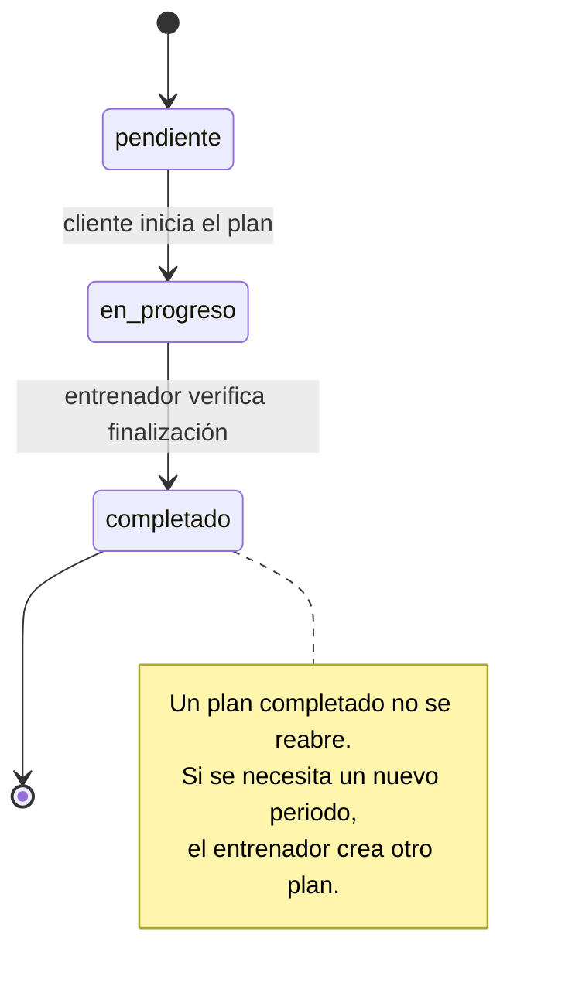

```mermaid
stateDiagram-v2
    [*] --> pendiente

    pendiente --> en_progreso : cliente inicia el plan
    en_progreso --> completado : entrenador verifica finalización

    completado --> [*]

    note right of completado
        Un plan completado no se reabre.
        Si se necesita un nuevo periodo,
        el entrenador crea otro plan.
    end note
```
