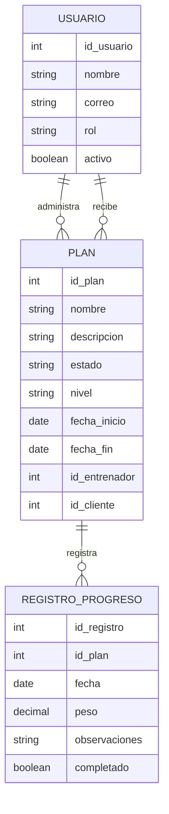

```mermaid
erDiagram
    USUARIO ||--o{ PLAN : "administra"
    USUARIO ||--o{ PLAN : "recibe"
    PLAN ||--o{ REGISTRO_PROGRESO : "registra"

    USUARIO {
        int id_usuario
        string nombre
        string correo
        string rol
        boolean activo
    }

    PLAN {
        int id_plan
        string nombre
        string descripcion
        string estado
        string nivel
        date fecha_inicio
        date fecha_fin
        int id_entrenador
        int id_cliente
    }

    REGISTRO_PROGRESO {
        int id_registro
        int id_plan
        date fecha
        decimal peso
        string observaciones
        boolean completado
    }
```
